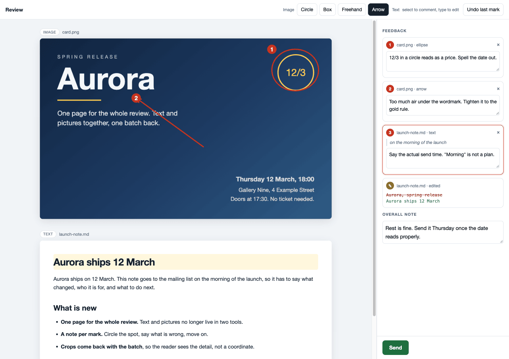
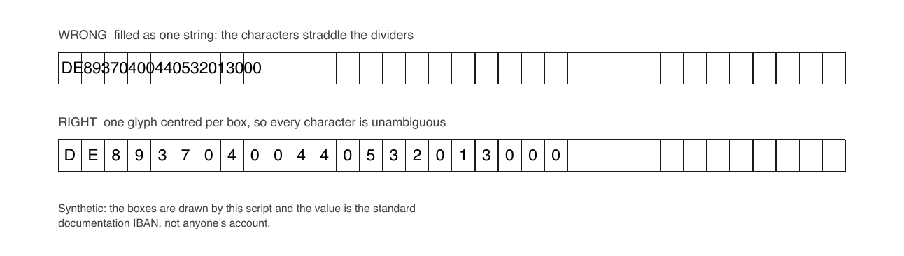

# honed-skills

[Agent Skills](https://agentskills.io/specification), honed against real work rather than written from imagination. Each skill here was extracted after doing the task for real, and it keeps the parts that only show up once you have hit them: the failure that looked like success, the flag that lied, the check that has to happen before you can claim the job is done.

The Agent Skills format is an open, cross-agent spec, so nothing here is tied to one product. A skill is a folder with a `SKILL.md`; the agent reads the `description`, decides the task matches, and loads the rest. Everything below is plain Python and command-line tools.

## Skills

| Skill | Use it when |
| --- | --- |
| [`human-review`](skills/human-review/) | A draft has to go in front of the person you are working for before it ships, and "does this look right?" in chat gets "looks good" back. They retype the text, comment on any selection, and circle the part of an image or PDF page that is wrong, with a note per mark. One local page for text and pictures together, one Send, one batch back. Python standard library only, no npm, works offline. |
| [`comb-pdf-form-filling`](skills/comb-pdf-form-filling/) | An official PDF form has to be filled so that each character lands inside its own printed box (a comb field): IBAN, tax number, BIC, dates. Built against German Behörden, tax and bank forms, and applies to any AcroForm or flat PDF with printed boxes. |
| [`drive-audit`](skills/drive-audit/) | Something in Google Drive is shared and you cannot tell what. Exposure in Drive lives on the ITEM, so a folder can report itself private while every file inside it is world-readable, and Drive has no view that shows you otherwise at any scale. Classifies every non-owner permission worst-first, diffs the result against a policy file where each approved share carries a reason and a date, and revokes or downgrades with a restorable snapshot written before the first deletion. Dry run until `--apply`. The classifier and its 21 offline cases run with no credentials, so you can check the logic before granting it access. |
| [`excalidraw`](skills/excalidraw/) | A diagram has to be produced as a `.excalidraw` file and look hand-drawn: architecture, flow, sequence, tree, mind map, timeline, network. Writes a short spec and expands it deterministically, with font widths measured in a browser against the real fonts rather than guessed from a multiplier, and a linter that runs before you look. |

**`human-review`.** One local page holds the card and the draft. Two marks sit on the picture, a third comments on a selected phrase, the retyped headline comes back as a before and after, and the numbered list on the right is what the agent receives:



**`comb-pdf-form-filling`.** A comb field prints one box per character, and filling it as an ordinary text field puts the string across the dividers. Same value, same field, both ways:



**`drive-audit`.** The report is the output, so the honest illustration is the report itself:
`scripts/example_report.py` prints this from invented findings, with no Drive and no credentials, and
you can rerun it to see exactly what went in.

```
=== public_indexed: 1 item(s), 0 folder(s) -- PUBLIC and search-indexed (anyone can find it)
  !     Old proposal.pdf                        reader   anyone            0B_EXAMPLE_INDEXED
=== external_writer: 1 item(s), 1 folder(s) -- a person outside the account can EDIT it
  ! DIR Handover                                writer   contractor@elsewhere.example
=== approved by policy: 1 item(s) suppressed
        Filing 2024.xlsx    advisor@example.com    outside accountant (since 2026-05-26)

scanned 8 item(s); reached 7 item(s) carrying a non-owner permission; 5 unapproved share(s) set
directly, 1 inherited, 1 approved
```

## Install

Copy the skill folder into your agent's skills directory. Name the destination explicitly:

```bash
git clone https://github.com/Plexito-de/honed-skills
mkdir -p ~/.claude/skills
cp -r honed-skills/skills/comb-pdf-form-filling ~/.claude/skills/comb-pdf-form-filling
```

Name the destination as above rather than ending the path at the parent. `cp -r src dest/` on a machine where `dest` does not exist yet copies the *contents* instead of the folder, so the skill lands as `~/.claude/skills/SKILL.md`, exits 0, prints nothing, and can never load. Verify with `ls ~/.claude/skills/comb-pdf-form-filling/SKILL.md`.

**Where the directory is** depends on your agent, and several agents share one:

| Agent | Personal skills directory |
| --- | --- |
| Claude Code, Claude | `~/.claude/skills/` |
| Codex, GitHub Copilot CLI, Gemini CLI | `~/.agents/skills/` (shared cross-runtime path; Gemini CLI also reads `~/.gemini/skills/`, and `~/.agents/skills/` wins when both exist) |
| Others | Check your agent's own docs. The [client showcase](https://agentskills.io/clients.md) lists the products that support the format, including Cursor, VS Code, OpenCode, OpenHands, Goose, Amp, Junie, Factory, Roo Code and Kiro. |

Most agents also read a project-level directory (commonly `.claude/skills/` or `.agents/skills/`) if you would rather commit a skill alongside a repo than install it per machine.

To update, `git pull` and copy again: a copied folder is a snapshot and does not track this repo. To uninstall, delete the folder you copied.

## What "honed" means here

A skill in this repo has to earn its lines:

- **Written after the work, not before.** The method is what actually produced a correct artifact, including the attempts that did not.
- **Verification is part of the method.** If a step can silently produce a wrong-looking-right result, the skill says how to look at the output and what to compare it against. In `comb-pdf-form-filling` that means rendering the finished PDF to an image and reading it, because a filled form can look correct in one viewer and broken in another, and a checkbox written to the wrong state reports success while granting nothing.
- **The gotchas are the payload.** A table of symptoms and causes beats a tidy description of the happy path, and it is the part you cannot get from an API reference.
- **Prior art is researched first and credited.** Where a public skill already covers ground, we read it at the source, take the ideas that hold up, say so, and state what ours adds. We do not copy code or text: a borrowed method you have not tested is worse than no method, and an unread dependency is a supply-chain risk.
- **No private data.** Examples use placeholder values only.

## Contributing

Issues and pull requests are welcome. A new skill needs a `SKILL.md` with `name` and `description` frontmatter, a gotchas section drawn from real use, placeholder-only examples, and a picture of the thing working where the output is something you can look at. The picture is generated from a script that ships with the skill, so anyone can regenerate it and see that nothing real went into it.

Two rules exist because a skills repo does not distribute documentation, it distributes instructions that land in someone else's agent context along with code that agent may run:

- **No `allowed-tools` declaration and no shell substitution in a skill body.** A skill must not pre-approve tools for itself or smuggle command execution into its text. If a skill needs a command run, it says so in prose and the human decides.
- **Scripts stay readable and dependency-light.** Anything under `scripts/` should be short enough to audit in one sitting, and its dependencies named in the frontmatter `compatibility` field.
- **Every skill here is scanned before it ships, and no finding is hidden.** We run [NVIDIA SkillSpector](https://github.com/NVIDIA/SkillSpector) over each skill and read the JSON rather than the exit code, because `skillspector scan` exits `0` for anything scoring 50 or less and a skill can carry a HIGH finding at 31. Whatever survives is either fixed or written down: a skill that keeps a finding ships a `.skillspector-baseline.yaml` giving the reason per rule and naming the alternative we rejected. That file changes nothing about your own scan, by design, since the tool ignores a baseline the author ships unless you ask for it with `--use-shipped-baseline`. It is there so you can see the decision and disagree with it. Two consequences you can check: **binary assets live outside the skill folder** (`docs/assets/`, referenced by absolute URL) because a bundled image the scanner cannot read is reported HIGH at fixed confidence, twice over in our case; and where a skill cannot reach `SAFE` we say why rather than suppressing the reason.

## License

[Apache-2.0](LICENSE). Each skill folder carries a copy, so the licence travels with it when you copy the folder out.
